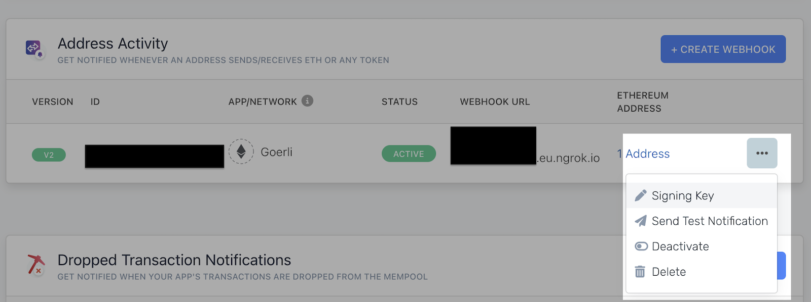
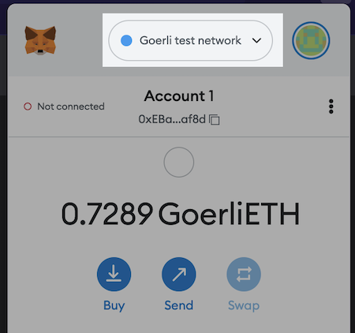
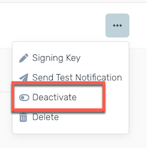

At the end of this tutorial, we will have built a simple Express App that exposes an API to listen for ethereum address activity (e.g. ERC20, ERC721 and ERC1155 transfer events).


We will be using the [Alchemy Notify API quickstart](https://docs.alchemy.com/reference/notify-api-quickstart). It provides easy-to-use webhook triggers based on transactions and events, and supports multiple [webhook event types](https://docs.alchemy.com/reference/webhook-types). We will use the [Address Activity Webhook](https://docs.alchemy.com/reference/address-activity-webhook) to send a mail to your ethereum address when a transaction occurs. The code for the webhook is based on the [Authenticated webhook tutorial](/developer/tutorials/authenticated-webhook.md), which is not a prerequisite, but can be helpful to review.

## Prerequisites

To complete this tutorial, you need to first:

1. Download and install [NodeJS](https://nodejs.org/en/download/).
1. [Create a new Mailchain account](/user/guides/getting-started/1-create-a-mailchain-account.md) for development and testing purposes.
1. [Register an Ethereum address in Mailchain](/user/guides/getting-started/2-register-a-wallet.md) to your dev and test account.
1. [Sign in or create Alchemy account](https://www.alchemy.com/)
1. [Ngrok account](https://dashboard.ngrok.com/signup) with [Ngrok installed](https://dashboard.ngrok.com/get-started/setup) on your machine.<br/> Ngrok will be used to expose the localhost to the internet in order to be accessible for the webhook, but feel free to use your own solution (e.g. gitpod.io) to expose the localhost for testing purposes.

## Step 1 - Clone Alchemy Notify example

Alchemy has a great ['Getting Started with Notify API' example](https://github.com/alchemyplatform/webhook-examples) repository on GitHub. We will clone this repository and use the [Node Express example](https://github.com/alchemyplatform/webhook-examples/tree/master/node-express).

To clone the Alchemy webhook examples and navigate into the correct folder, run the following commands in a new terminal:

```bash
git clone https://github.com/alchemyplatform/webhook-examples.git
cd webhook-examples/node-express
```

Now run `yarn` in this directory to install all the dependencies.

:::note
If you don't have yarn, please check [Yarn Installation instruction](https://classic.yarnpkg.com/lang/en/docs/install/#mac-stable).
:::

```bash
yarn install
```

## Step 2 - Configure Address Activity webhook

1. Navigate to the [Notify section](https://dashboard.alchemy.com/notify) in the Alchemy Dashboard.
1. Run `ngrok http 8080` in a terminal window and copy the `Forwarding` value from the output, it will be something like `https://012a-93-12-152-21.eu.ngrok.io`. Leave `ngrok` running so the webhook can be reached by Alchemy Notify.
1. Under the **Address Activity** section in Notify Alchemy Dashboard click the `+ CREATE WEBHOOK` button. This will open up a form with some input fields:

    - **Chain**: Select `Ethereum`
    - **Network**: For testing purposes select `Goerli`.
    - **Webhook URL**: Paste in the `Forwarding` value from ngrok followed with `/webhook-path` (ex. `https://012a-93-12-152-21.eu.ngrok.io/webhook-path`)
    - **Ethereum Addresses**: This is the address that will be monitored. Enter the Ethereum address that you have registered to Mailchain and that you want to monitor for events. An Ethereum address will look something like `0xEBaae0531dF65ee3a1623f324C9620bB84c8af8f`.
    - Click on the `CREATE WEBHOOK` to finish creating the web hook.

[Alchemy signs each webhook requests](https://docs.alchemy.com/reference/notify-api-quickstart#webhook-signature--security) to prevent un authorized access. In the example app, signatures are validated by the `validateAlchemySignature` method.

To make this example work and validate the signature against the correct key, we need to get the "webhook signing key". Later which we will set this in our application.

To get the "webhook signing key", navigate to the Notify Alchemy Dashboard and scroll down to the webhook and by clicking on the options `⋯` button, then click `Signing Key`. A box will open with the signing key, it will look something like `whsec_EcQnhWcncVkYyda2UgL15kiL`.



Copy the key and save it somewhere safe. We will use it in the next step of the tutorial.

## Step 3 - Configure environment variables and start the application

We need to add some environment variables before we can run our application. Environment variables let you set values that are passed to your server-side code. For development and testing, we can use [dotenv](https://www.npmjs.com/package/dotenv) and configure environment files in the root directory of the app, named according to the environment, e.g. `'.env.development.local'`.

:::warning

Care must be taken to avoid storing environment variables in source control. For this tutorial, there is a `.gitignore` file. This tells git to ignore each of the existing environment files. This prevents changes to the existing environment files from being stored in git. Make sure you add new environments to `.gitignore`.
:::

As mentioned in the warning above, add the following lines to `'.gitignore'`:.

```txt
# ENV
.env
.env.local
.env.development.local
.env.test.local
.env.production.local
```

Create a file in the root directory of your app called `'.env.development.local'` file. Open it in your code editor and include the following values:

It should look like this:

```txt
PORT=8080
HOST="localhost"
SIGNING_KEY="whsec_IJlXg...Xd"
SECRET_RECOVERY_PHRASE="your secret ... recovery phrase"
```

-   `SECRET_RECOVERY_PHRASE` - your secret recovery phrase for your development Mailchain account
-   `SIGNING_KEY` - webhook signing key obtained from Alchemy earlier

Add `dotenv` as dependency to the app by running:

```bash
yarn add dotenv
```

Instead of the default setup from the Alchemy example, we want our application to use environment variables via `dotenv`. Open `'src/index.ts'` and replace the contents with the following code:

```ts
import dotenv from 'dotenv';
import express from 'express';
import { addAlchemyContextToRequest, validateAlchemySignature, AlchemyWebhookEvent } from './webhooksUtil';
dotenv.config({ path: `.env.${process.env.NODE_ENV || 'development'}.local` });

async function main(): Promise<void> {
	const app = express();
	const port = Number(process.env.PORT) || 8080;
	const host = process.env.HOST || '127.0.0.1';
	const signingKey = process.env.SIGNING_KEY || '';

	// Middleware needed to validate the alchemy signature
	app.use(
		express.json({
			verify: addAlchemyContextToRequest,
		}),
	);
	app.use(validateAlchemySignature(signingKey));

	// Register handler for Alchemy Notify webhook events
	app.post('/webhook-path', (req, res) => {
		const webhookEvent = req.body as AlchemyWebhookEvent;
		console.log(`Processing webhook event id: ${webhookEvent.id}`);

		if ((webhookEvent.event.eventDetails = '<EVENT_DETAILS>')) {
			// this is test notification send from Alchemy. Return success.
			return res.send('Alchemy Notify is the best!');
		}
	});

	// Listen to Alchemy Notify webhook events
	app.listen(port, host, () => {
		console.log(`Example Alchemy Notify app listening at ${host}:${port}`);
	});
}

main();
```

We can now start our the application by running the following command:

```bash
yarn start
```

To verify that the webhook is configured properly, go into Alchemy Dahsboard and click the options dropdown of the configured webhook and click the `Send Test Notification` button.

If everything is correctly configured, the terminal with `ngrok` running will show a `POST / 200 OK` and the terminal running our application will print out something like `Processing webhook event id: whevt_s8wrj49yxo19qsoy`.

## Step 4 - Webhook event handling

In `src/index.ts` you can see an already a configured Express application with route of `POST /webhook-path`, this route accepts our webhook events. Inside the route there is field called `webhookEvent` that holds all the event data the app will receive.

Check Alchemy's [field definition](https://docs.alchemy.com/reference/address-activity-webhook#field-definitions) to understand what data will be sent by this event.

To create our Mailchain message we will extract the `fromAddress` and `toAddress`. To simplify the example, we will handle only events with `category` of `external` that represent the native chain token (e.g. ETH).

Next, let's define the `mailSubject` and `mailContent` of the mail that we are going to send out with Mailchain.

Add the following code below the check for test event:

```ts
const webhookEvent = req.body as AlchemyWebhookEvent;
console.log(`Processing webhook event id: ${webhookEvent.id}`);

if ((webhookEvent.event.eventDetails = '<EVENT_DETAILS>')) {
	// this is test event send from Alchemy. Return success.
	return res.send('Alchemy Notify is the best!');
}
// highlight-start
if (webhookEvent.type !== 'ADDRESS_ACTIVITY') return res.status(400).send('Only ADDRESS_ACTIVITY event type supported');

for (const activity of webhookEvent.event.activity) {
	if (activity.category !== 'external') continue;

	const { fromAddress, toAddress, value, asset, hash } = activity;

	const mailSubject = `Funds transfer from ${fromAddress} into ${toAddress}`;
	const mailContent = {
		text: `There has been a transfer of ${value}${asset} from ${fromAddress} to ${toAddress}. You can check the transaction details on https://goerli.etherscan.io/tx/${hash}.`,
		html: `<p>There has been a transfer of <b>${value}${asset}</b> from <b>${fromAddress}</b> into <b>${toAddress}<b>.</p><p>Check the transaction details on <a href="https://goerli.etherscan.io/tx/${hash}">Etherscan</a>.</p>`,
	};
}
// highlight-end
```

## Step 5 - Setup Mailchain SDK

Now we need to install the Mailchain SDK. Stop the application and run the following command:

```bash
yarn add @mailchain/sdk
```

Once `@mailchain/sdk` is installed restart the application with the `yarn start` command.

In `'src/index.ts'`, import the Mailchain SDK and create new instance of it immediately after the assertion of the event type of `"const signingKey = ..."` in the `main` function.

```ts
const signingKey = process.env.SIGNING_KEY || '';
// highlight-start
const { Mailchain } = await import('@mailchain/sdk');
const secretRecoveryPhrase = process.env.SECRET_RECOVERY_PHRASE || '';
const mailchain = Mailchain.fromSecretRecoveryPhrase(secretRecoveryPhrase);
// highlight-end
```

## Step 6 - Send mail with Mailchain SDK

Now that we have included the mail content and have setup the SDK, sending a mail is very easy. Right after the declaration of the `mailSubject` and `mailContent` fields add the following snippet:

```ts
await mailchain.sendMail({
	from: (await mailchain.user()).address,
	to: [`${fromAddress}@ethereum.mailchain.com`, `${toAddress}@ethereum.mailchain.com`],
	subject: mailSubject,
	content: mailContent,
});
```

For easier async logic, you also need to update the webhook-path route (`app.post('/webhook-path)...`) and make it an `async` function. Edit definition to inlude `async`.

```ts
app.post('/webhook-path', async (req, res) => {
	/* existing route fn code **/
});
```

This function will send a message both to the `fromAddress` and `toAddress` address of the token transfer. For simplicity of the example there is no logic to only send mail to the monitored addresses by the webhook. A solution to send mail only to monitored address would include cross-checking the addresses against the [Alchemy SDK returning the addresses for the configured webhook](https://docs.alchemy.com/reference/sdk-get-addresses-webhooks).

## Step 7 - Faucet some funds into your address and test it out

In order not to transfer real ETH on mainnet, we are using the Goerli testnet. For these testnets you can request some free funds to be added to your address, for Goerli this is done via [https://goerlifaucet.com/](https://goerlifaucet.com/). Just input your address into the field and get some free test tokens.

This transfer is going to actually fire up a event by the webhook since we are transferring funds to our monitored address. Go on and check your Mailchain mailbox for new messages on [https://app.mailchain.com](https://app.mailchain.com).

To further test this, you can make small transfers between your Ethereum accounts. Make sure you have selected Goerli testnet on your wallet before making the transfers.



## Conclusion

Congratulations 🎉 you've built an awesome App that can notify you or your users of changes of their address funds.

For full working example head over to the forked repository of the original example, [Example Alchemy Notify Webhooks Server in Node + Mailchain SDK](https://github.com/mailchain/alchemy-webhook-examples/tree/master/node-express).

:::warning
Don't forget to de-activate the webhook in your Alchemy account when you are finished!


:::

## What's next?

As mentioned before Alchemy has an API and SDK for JS that can be used to create, update and remove Notify webhooks. This is very useful if we want to make a meaningful implementation that is not used just for testing. You can access the [Alchemy SDK Quickstart](https://docs.alchemy.com/reference/alchemy-sdk-quickstart) to get started and learn more.

On top of this, checkout more generic approach of webhooks with [authenticated webhook guide](/developer/tutorials/authenticated-webhook.md). Let us know of any interesting variations of this tutorial that you have made or if you need any support via our [Discord](https://discord.gg/2gqGpagbhe) channel.
